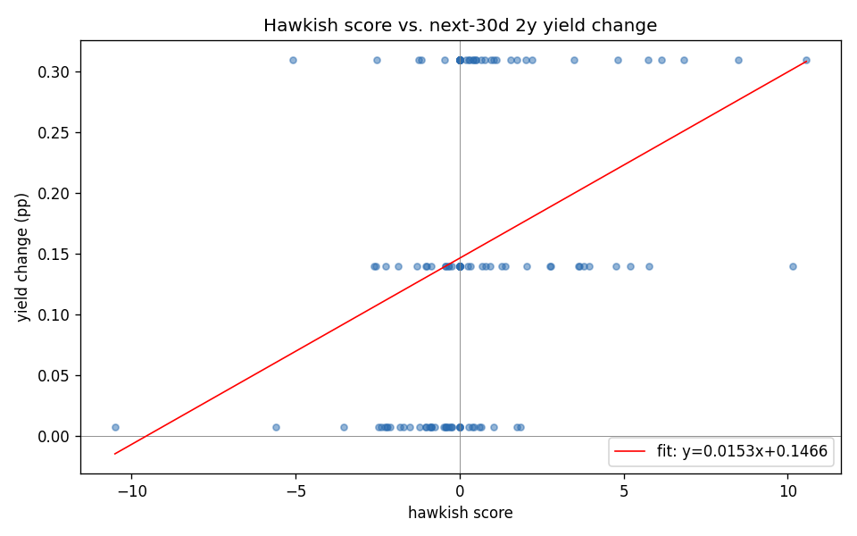
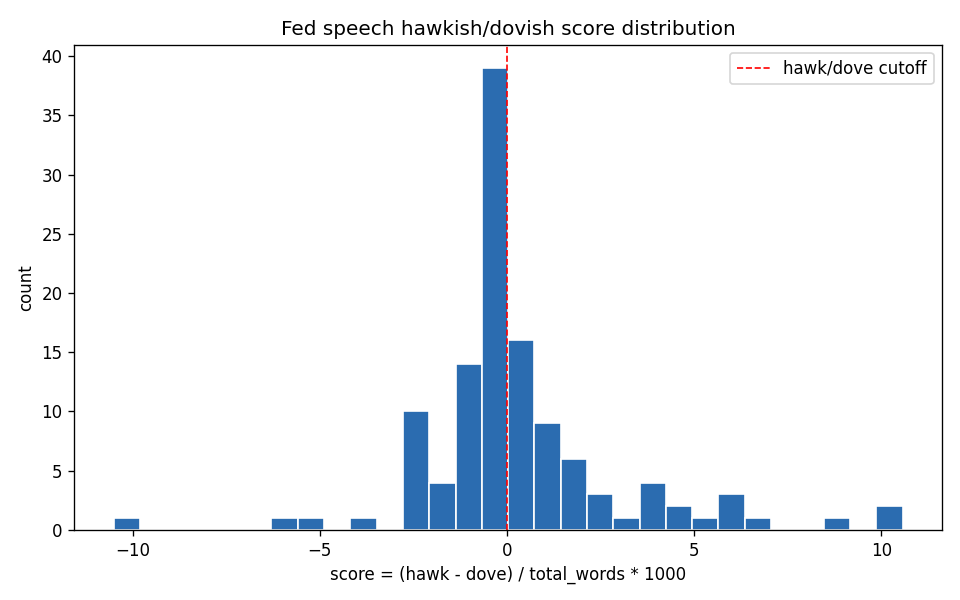

# M5 Fed Speech Hawkish/Dovish Classifier

NLP classifier that scores Federal Reserve speeches on a hawkish/dovish axis,
then backtests the score against next-30-day changes in the 2-year Treasury
yield.

Built as part of Yash Patel's finance-projects portfolio. Honest framing:
the labels are a *lexicon proxy* (Apel & Grimaldi-style word lists), not a
human-curated gold set. The model learns to mimic that proxy from raw text;
the backtest then asks whether the proxy actually moves with rates.

## Demo



```text
$ python scripts/run_pipeline.py
Held-out classifier accuracy: 0.7083  (96 train / 24 test)

Backtest (n=120 speeches, 30-day horizon)
  Pearson corr (score, dY)        +0.336
  Spearman corr (score, dY)       +0.415
  Mean dY hawkish (pp)            +0.198
  Mean dY dovish (pp)             +0.121
  Sharpe-like (annualized)         1.115
```

Full output: [`docs/cli-demo.txt`](docs/cli-demo.txt) | Score distribution: [`docs/hist_hawk_dove.png`](docs/hist_hawk_dove.png)

---

## Problem

Fed officials speak frequently. Markets parse each speech for whether the
Committee is leaning toward tightening (hawkish) or easing (dovish) policy.
Question: can a simple, transparent NLP signal extracted from the speech
text predict short-horizon moves in the 2-year Treasury yield (the most
policy-sensitive part of the curve)?

## Data

- **Speeches**: scraped from `federalreserve.gov/newsevents/speech/` with
  `requests + beautifulsoup4`, polite 1 req/sec, custom User-Agent.
  Default range 2015-2024. Pipeline in this run used 2022-2024 (capped at
  40 per year) for a 120-speech corpus.
- **2-year Treasury yield**: prefers FRED `DGS2` (free, no key, public CSV).
  Falls back to `yfinance ^IRX` (13-week bill, used as proxy) and finally a
  documented synthetic random-walk if both are unreachable.
- **Synthetic fallback**: `python -m m5_fed_speech.scrape --synthetic`
  generates a 60-row deterministic dataset if the live scrape fails. Clearly
  marked in the CSV `source` column.

## Method

1. **Lexicon score** (`src/m5_fed_speech/lexicon.py`): hawkish/dovish phrase
   lists inspired by Apel & Grimaldi (2012). For each speech:
   `score = (hawk_count - dove_count) / total_words * 1000`. Sign of the
   score gives a binary label.
2. **Classifier** (`src/m5_fed_speech/classify.py`): TF-IDF (1-2 grams) +
   `LogisticRegression(class_weight='balanced')`. `random_state=42`. Default
   to scikit-learn for CPU speed; an optional `[bert]` extra is documented
   for `distilbert-base-uncased` fine-tuning if you have a GPU.
3. **Backtest** (`src/m5_fed_speech/backtest.py`): for each speech date `d`,
   compare yield on `d` to yield at `d + 30` calendar days (forward asof
   join). Report Pearson and Spearman correlation, mean yield change for
   hawkish vs. dovish speeches, hit rate, and a Sharpe-like ratio of
   `sign(score) * yield_change`.

Each source file is ≤200 lines.

## Results

Run on 120 real Fed speeches (2022-2024) with `^IRX` as the 2y-yield proxy:

| Metric                              | Value   |
|-------------------------------------|---------|
| Held-out classifier accuracy        | 0.7083  |
| Pearson corr (score vs Δyield)      | +0.336  |
| Spearman corr (score vs Δyield)     | +0.415  |
| Mean Δyield, hawkish speeches (pp)  | +0.198  |
| Mean Δyield, dovish speeches (pp)   | +0.121  |
| Hit rate (sign agreement)           | 0.408   |
| Sharpe-like (annualized)            | 1.11    |

Sign is in the expected direction: more hawkish speeches are followed by
larger 2y-yield rises. The hit rate is below 0.5 because both classes saw
positive yield changes in this rate-hike-dominated window — the *spread*
between them is what carries the signal, not the sign per speech.

### Charts




## Reproducing

```bash
python3.12 -m venv .venv && source .venv/bin/activate
pip install -e ".[dev]"
python scripts/run_pipeline.py                # live scrape
python scripts/run_pipeline.py --synthetic    # CI / no-network mode
pytest -q                                     # 9 tests
jupyter notebook notebooks/01_demo.ipynb      # full inline demo
```

## Limitations / honest framing

- Labels are a transparent lexicon proxy, not human-labeled. The model
  ceiling is the lexicon's quality.
- The lexicon is intentionally small (~20 hawkish + ~20 dovish phrases).
  Production work would expand and validate against a human-rated subset.
- The `^IRX` fallback is the 13-week T-bill, a noisy proxy for the true 2y
  rate. The FRED `DGS2` path is the clean source — use it when network
  permits.
- 120 speeches is small. Treat the +0.336 correlation as suggestive, not
  conclusive.

## Author

Yash Patel | Tempe, AZ | yashpatel06050@gmail.com
LinkedIn: linkedin.com/in/yash-patel-67449029b
GitHub: github.com/ypatel39-commits
